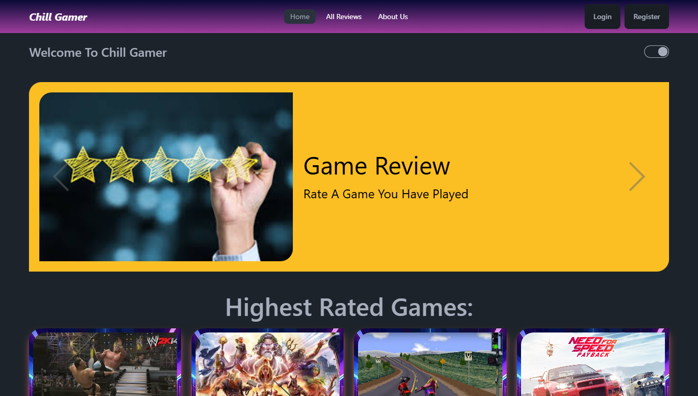

# Chill Gamer 🎮✨

  

### Welcome to Chill Gamer !!!

A user-friendly game review application where users can explore and share reviews of their favorite games. With its clean design and robust functionality, Chill Gamer provides a "chill" experience for all gamers.

## 🚀 Live site URL:

- https://assignment-10-5f987.web.app/
- https://assignment-10-5f987.firebaseapp.com/

## 🛠️ Technologies Used:

Chill Gamer is built with modern React-based technologies:

- 1. Frontend: React, React Router, React Icons.
- 2. State Management: LocalForage.
- 3. Authentication: Firebase (Email/Password, Google Auth).
- 4. Styling: Tailwind CSS, DaisyUI.
- 5. UI Enhancements: React Awesome Slider, Swiper, Typewriter Effects.
- 6. Notifications: React Toastify, SweetAlert2.