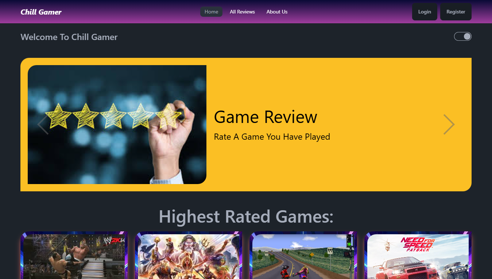

# Chill Gamer 🎮✨

  

### Welcome to Chill Gamer !!!

A user-friendly game review application where users can explore and share reviews of their favorite games. With its clean design and robust functionality, Chill Gamer provides a "chill" experience for all gamers.

## 🚀 Live site URL:

- https://assignment-10-5f987.web.app/
- https://assignment-10-5f987.firebaseapp.com/

## Bullet points to feature of the project:

- 1. Responsive Design: Seamlessly adapts to mobile, tablet, and desktop views.
- 2. User Authentication: Login and Register functionality with email-password and Google Authentication.
- 3. Review Management:  Add, Update, and Delete reviews.
- 4. Watchlist: Add games to your personalized watchlist and manage them effortlessly.
- 5. Dark/Light Mode: Switch between themes for a personalized browsing experience.
- 6. Modern Animations: Smooth transitions using libraries like React Lottie, Typewriter, and Awesome Reveal.